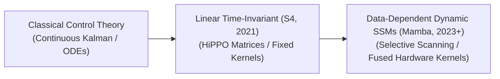

# Awesome-State-Space-Models
## State Space Models (SSMs) in AI: Evolution, Variants, & Applications

State Space Models (SSMs) represent a revolutionary paradigm shift in sequence modeling, offering a mathematically rigorous alternative to both Recurrent Neural Networks (RNNs) and Transformers. Originally derived from classical control theory, modern deep learning SSMs map a continuous 1D input signal $x(t)$ to an output signal $y(t)$ through an intermediate latent state $h(t)$. By parameterizing these differential equations into discrete structures, advanced SSMs achieve **linear scaling ($O(N)$) with sequence length** and maintain a **constant-size memory footprint during inference**, bypassing the quadratic computational and memory bottlenecks ($O(N^2)$) that plague the Transformer's self-attention mechanism.

---

## 1. The Chronological Evolution

The technical progression of SSMs reflects a transition from classical mathematical physics to linear time-invariant deep layers, moving toward modern data-dependent dynamic routing engines.

| Era / Concept | Year | First Paper | Details |
| :--- | :--- | :--- | :--- |
| [**The Continuous Control Era (Classical Roots)**](./details/continuous-control-era.md) | 1960 | [Kalman (1960)](https://doi.org/10.1115/1.3662552) | **Concept:** Built upon continuous-time differential equations and Kalman filtering frameworks from the 20th century. Used to model physical systems where hidden states track changes over continuous timelines. **Limitation:** Suffered from the vanishing/exploding gradient problem over long sequences, making them functionally useless for complex natural language tasks. |
| [**The Structured Linear Time-Invariant Era (S4, Gu et al., 2021)**](./details/structured-lti-era.md) | 2021 | [Gu et al. (2021)](https://arxiv.org/abs/2111.00396) | **Concept:** Formally established by the **Structured State Space (S4)** model. It introduced the **HiPPO (High-order Polynomial Projection Operators)** matrix to initialize the hidden state transitions, allowing the model to mathematically memorize long-range histories. Because parameters were fixed across time steps (Linear Time-Invariant, or LTI), the model could be trained in parallel like a CNN, but execute inference quickly like an RNN. **Limitation:** LTI properties meant the model could not modify its parameters dynamically based on incoming context, making it struggle with fine-grained context-switching tasks (like copying strings or switching conversational topics). |
| [**The Selective & Hardware-Aware Era (Mamba, Gu & Dao, 2023–Present)**](./details/selective-hardware-aware-era.md) | 2023 | [Gu & Dao (2023)](https://arxiv.org/abs/2312.00752) | **Concept:** The modern state-of-the-art frontier framework. **Mamba** introduced **Selective SSMs**, making the state transition matrices dynamic functions of the input data. To overcome the training latency introduced by discarding LTI properties, it implements a hardware-aware **Selective Scan Algorithm**, executing state transitions entirely within fast on-chip GPU SRAM. |

---

## 2. Core Functional & Algorithmic Variants

Deep learning SSMs are strictly categorized based on how their state transition parameters ($A, B, C$) behave across chronological sequences.

| Variant | Year | First Paper | Details |
| :--- | :--- | :--- | :--- |
| [**Linear Time-Invariant (LTI) SSMs**](./details/lti-ssms.md) | 2021 | [Gu et al. (2021)](https://arxiv.org/abs/2111.00396) | **Mechanism:** The transition matrices ($A, B, C$) remain absolute constants and do not change across sequence time-steps, regardless of what words or tokens enter the system. **Pros:** Can be expanded into a single global convolution kernel during training, allowing for massive parallel processing on GPUs ($O(N \log N)$ complexity). **Examples:** S4, S4D, and Diagonal State Spaces (DSS). |
| [**Selective / Linear Time-Varying (LTV) SSMs**](./details/selective-ltv-ssms.md) | 2023 | [Gu & Dao (2023)](https://arxiv.org/abs/2312.00752) | **Mechanism:** Bypasses LTI constraints. The matrices $B$ and $C$, along with the discretization step $\Delta$, are computed dynamically from the incoming token embeddings at each step. **Pros:** Acts as an information filter. The model can choose what tokens to remember and what tokens to permanently evict from its hidden state, matching the reasoning capacity of Transformers. **Examples:** Mamba, Mamba-2. |
| [**Structured State Space Duals (SSD / Mamba-2)**](./details/structured-state-space-duals.md) | 2024 | [Dao & Gu (2024)](https://arxiv.org/abs/2405.21060) | **Mechanism:** A mathematical unification framework introduced in Mamba-2. It proves a theoretical duality between state space models and specific structured attention mechanisms. **Pros:** Unlocks the ability to use highly optimized Matrix Multiplication (Tensor Core) hardware pathways on modern GPUs, speeding up training throughput by over $2\times$ vs. baseline Mamba. |

---

## 3. High-Yield Architectural Hybrid Types

Because SSMs excel at linear sequence tracking but lack the absolute cross-token retrieval fidelity of full attention, modern systems deploy hybrid combinations.

| Hybrid Type | Year | First Paper | Details |
| :--- | :--- | :--- | :--- |
| [**SSM-Attention Hybrids (Jamba / Samba / RecurrentGemma)**](./details/ssm-attention-hybrids.md) | 2022 | [Fu et al. (2022)](https://arxiv.org/abs/2212.14052) | **Layout:** Interleaves standard Selective SSM layers (e.g., Mamba) with sparse Multi-Head Attention blocks sequentially (e.g., 1 Attention layer for every 6 SSM layers). **Significance:** Blends the strengths of both paradigms: the hybrid retains the long-range mathematical precision of full attention while exploiting the linear speedups and compact memory footprints of state spaces. |
| [**SSM-MoE Hybrids (Mixture-of-Experts SSMs)**](./details/ssm-moe-hybrids.md) | 2024 | [Anthony et al. (2024)](https://arxiv.org/abs/2402.01771) | **Layout:** Integrates a sparse Mixture-of-Experts routing network directly behind the dense linear projection layers of an SSM cell block. **Significance:** Dramatically expands total model capacity (scaling up parameter counts into the hundreds of billions) while keeping active compute overhead low per token. |

---

## 4. Production Engineering Benefits & Trade-Offs

Deploying State Space architectures inside commercial pipelines changes the compute and serving dynamics of enterprise infrastructure.

| Benefit / Trade-off | Year | First Paper | Details |
| :--- | :--- | :--- | :--- |
| [**The Linear Memory Advantage ($O(1)$ Inference Cache)**](./details/linear-memory-advantage.md) | 2021 | [Gu et al. (2021)](https://arxiv.org/abs/2111.00396) | **The Transformer Bottleneck:** Standard LLMs suffer from Key-Value (KV) Cache inflation, where the memory required to host historical token states grows linearly with every word generated, capping max batch sizes. **The SSM Solution:** The entire sequence history is compressed into a fixed-size hidden state matrix. VRAM consumption remains **flat, constant ($O(1)$), and unchanging** whether the model processes 1,000 tokens or 1,000,000 tokens, enabling massive concurrent serving batches. |
| [**The "Needle in a Haystack" Retrieval Deficit**](./details/needle-in-a-haystack-deficit.md) | 2023 | [Gu & Dao (2023)](https://arxiv.org/abs/2312.00752) | **The Problem:** Because SSMs squash an infinitely long document into a fixed-size vector space, the model can experience information compression loss, occasionally struggling to retrieve highly specific, long-tail facts buried deep inside massive prompts. **Mitigation:** Strategic layering of token-anchored cross-attention layers or sliding-window attention blocks within terminal decoder checkpoints. |

---

## 5. Frontier Real-World Applications

| Frontier Application | Year | First Paper | Details |
| :--- | :--- | :--- | :--- |
| [**Ultra-Long Context Document & Legal Auditing**](./details/ultra-long-context-document-legal-auditing.md) | 2023 | [Gu & Dao (2023)](https://arxiv.org/abs/2312.00752) | **Application:** Processes entire code repositories, encyclopedias, or centuries of legal case text files in a single forward pass. SSMs scale to millions of tokens context windows on standard server nodes without encountering the catastrophic memory crashes typical of Transformers. |
| [**High-Resolution 1D Biomedical Genomic Mapping**](./details/high-resolution-1d-biomedical-genomic-mapping.md) | 2024 | [Schiff et al. (2024)](https://arxiv.org/abs/2403.03234) | **Application:** Evaluates raw DNA and RNA base-pair strands ($A, C, G, T$). Because genomic data spans hundreds of thousands of tokens where mutations display immense long-range sequence dependencies, models like **Caduceus** leverage bidirectional SSM layouts to track macro-molecular mutations efficiently. |
| [**Continuous Streaming Time-Series & Audio Analytics**](./details/continuous-streaming-time-series-audio-analytics.md) | 2022 | [Goel et al. (2022)](https://arxiv.org/abs/2202.09729) | **Application:** Monitors continuous high-frequency waves (such as seismic sensors, cardiac ICU telemetry, or raw acoustics). Because discrete discretization parameters ($\Delta$) act as natural signal sampling filters, SSMs track shifting continuous wave trajectories without data interpolation gaps. |

