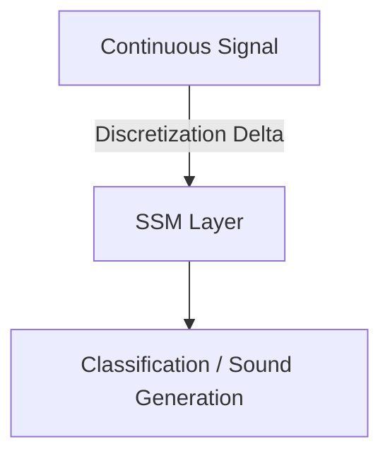

# Continuous Streaming Time-Series & Audio Analytics

## Overview
Because SSMs are defined using continuous differential equations, they excel at modeling continuous physical signals such as audio, seismic telemetry, and medical sensor streams.

## Architecture Diagram

## Technical Details
### Continuous-to-Discrete Representation
Physical sensors generate high-frequency continuous data. Because SSMs are rooted in continuous-time differential equations:
1. **Signal Discretization:** The discretization step size $\Delta$ acts as a sampling rate filter.
2. **Multi-Rate Modeling:** The model can adjust to different telemetry sampling rates by simply changing $\Delta$ during evaluation, without retraining.

### Key Domains
- **Raw Audio Processing:** SaShiMi uses structured SSMs to generate raw waveforms, capturing long-term audio coherence.
- **Biomedical Sensor Telemetry:** Tracking continuous ECG or EEG signals in ICU patient monitoring pipelines.

## References
- Goel, K., Gu, A., Donahue, C., & Ré, C. (2022). "It's Raw! Audio Generation with State-Space Models." *ICML*.
- Alcaraz, J. C. L., & Strijbos, M. (2022). "State Space Models for Multivariate Time Series Forecasting." *arXiv preprint arXiv:2207.01211*.

---
[← Back to README](../README.md)
