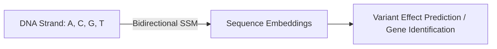

# High-Resolution 1D Biomedical Genomic Mapping

## Overview
Biomedical sequences like DNA span millions of base-pairs. Models like Caduceus leverage bidirectional SSM layouts to analyze genomic structures and long-range sequence mutations efficiently.

## Architecture Diagram

## Technical Details
### The Genomic Sequence Challenge
Genomic sequencing datasets consist of DNA/RNA bases ($A, C, G, T$) stretching over billions of steps.
1. **Long-Range Dependencies:** Mutations in non-coding regions can affect gene expression millions of base-pairs away.
2. **Quadratic Scaling Failure:** Attention models are unable to scale to context windows of this size.

### The SSM Solution
Genomic models like **Caduceus** leverage bidirectional State Space Layers:
- **Bidirectionality:** Since DNA is double-stranded and has no natural 'left-to-right' direction, bidirectional state tracking is critical.
- **Linear Efficiency:** Captures multi-megabase contexts to model DNA structural dependencies without computational bottlenecks.

## References
- Schiff, L., et al. (2024). "Caduceus: Bi-Directional Equivariant Long-Range DNA Sequence Modeling." *arXiv preprint arXiv:2403.03234*.

---
[← Back to README](../README.md)
