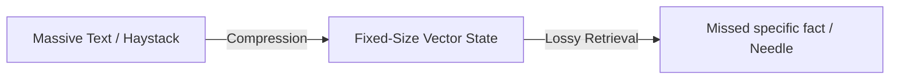

# The "Needle in a Haystack" Retrieval Deficit

## Overview
Due to compressing sequence history into a fixed-size hidden state, pure SSMs can struggle to retrieve specific, long-tail facts buried deep inside massive contexts.

## Architecture Diagram

## Technical Details
### The Compression Bottleneck
The mathematical strength of SSMs—compressing history into a fixed-size latent state to achieve constant memory footprint—is also their primary limitation. 
- **Lossy Compression:** Compressing a million-token sequence into a fixed-dimensional vector space is mathematically lossy.
- **Retrieval Deficit:** Standard Transformers keep all raw historical tokens in memory (KV Cache), letting them perform precise retrieval. SSMs must rely on the latent representation, which can overwrite sparse or isolated facts ("needles") when new information flows in.

### Mitigation Strategies
1. **Interleaved Attention Layers:** Inserting sparse self-attention layers to recover exact token indexing.
2. **Complex Updates (Mamba-3):** Enhancing state-space representations to track high-entropy state changes better.

## References
- Liu, N.F., Lin, K., Hewitt, J., Paranjape, A., Bevilacqua, M., Petroni, F., & Liang, P. (2023). "Lost in the Middle: How Language Models Use Long Contexts." *arXiv preprint arXiv:2307.03172*.
- De, S., et al. (2024). "Griffin: Mixing Gated Linear Recurrent Units with Local Attention for Efficient Language Models." *arXiv preprint arXiv:2402.19427*.

---
[← Back to README](../README.md)
