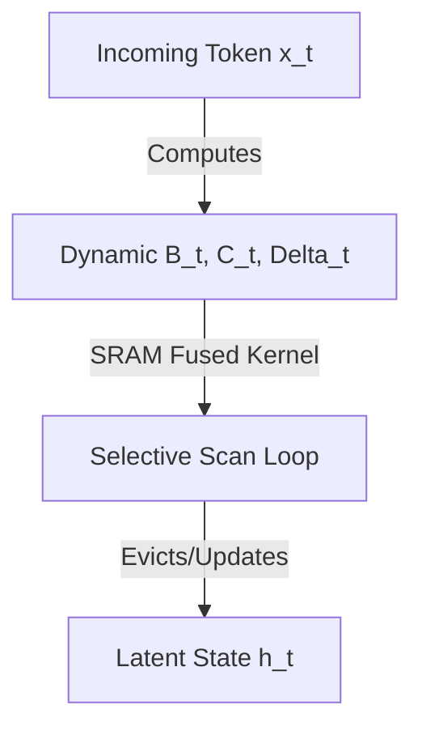

# The Selective & Hardware-Aware Era (Mamba)

## Overview
Mamba introduced input-dependent selective scan mechanisms to enable SSMs to filter relevant information dynamically, combined with hardware-aware memory management to bypass the training latency of non-LTI systems.

## Architecture Diagram

## Technical Details
### Selection Mechanism
Mamba removes the Linear Time-Invariant constraint by making the transition parameters functions of the input:
$$B_t = s_B(x_t), \quad C_t = s_C(x_t), \quad \Delta_t = \text{softplus}(w_\Delta + s_\Delta(x_t))$$
This turns the LTI system into a Linear Time-Varying (LTV) system. The model can choose what to memorize and what to discard, resolving the fine-grained context-switching and copying deficits of LTI models.

### Hardware-Aware Optimization
Because LTV systems cannot be unrolled as convolutions, sequential scans would normally run slowly on GPUs. Mamba resolves this by:
1. **Memory Hierarchy Exploitation:** Keeping the state transitions within GPU **SRAM** rather than reading/writing to slower **HBM** (High Bandwidth Memory).
2. **Kernel Fusion:** Fusing the discretization and recurrent scan into a single custom CUDA kernel.

## References
- Gu, A., & Dao, T. (2023). "Mamba: Linear-Time Sequence Modeling with Selective State Spaces." *arXiv preprint arXiv:2312.00752*.

---
[← Back to README](../README.md)
