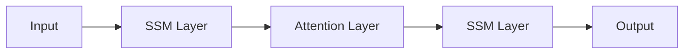

# SSM-Attention Hybrids

## Overview
SSM-Attention Hybrids interleave linear State Space Model layers with self-attention layers to combine the infinite-context compression of SSMs with the exact retrieval capabilities of attention.

## Architecture Diagram

## Technical Details
### Core Architecture
While pure SSMs scale linearly, they can struggle with exact retrieval over extremely long context windows. Hybrid models resolve this by interleaving blocks:
- **SSM Layers (e.g., Mamba):** Handle sequence modeling over long distances with $O(N)$ efficiency.
- **Attention Layers:** Perform localized or sparse full-context cross-retrieval to prevent information degradation.

### Examples
- **H3 (2022):** The first model to interleave state spaces with attention.
- **Jamba (2024):** Integrates Mamba and Attention blocks along with Mixture-of-Experts.
- **RecurrentGemma (2024):** A commercial-grade hybrid model from Google utilizing recurrent linear blocks and attention.

## References
- Fu, D.Y., Sabharwal, A., Soltani, B., & Ré, C. (2022). "Hungry Hungry Hippos: Towards Language Modeling with State Space Models." *arXiv preprint arXiv:2212.14052*.
- AI21 Labs (2024). "Jamba: A Hybrid Transformer-Mamba Language Model." *arXiv preprint arXiv:2403.19887*.

---
[← Back to README](../README.md)
