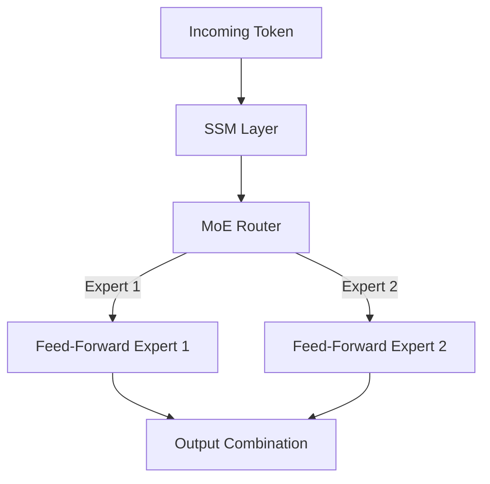

# SSM-MoE Hybrids (Mixture-of-Experts SSMs)

## Overview
SSM-MoE Hybrids combine state space models with sparse Mixture-of-Experts (MoE) routing, creating massive model parameter scaling with low compute overhead.

## Architecture Diagram

## Technical Details
### Architectural Integration
Mixture-of-Experts (MoE) routes inputs to a subset of neural network 'experts' dynamically. Combining MoE with SSMs:
1. Replaces the dense Feed-Forward Network (FFN) blocks of the SSM layer with an MoE block.
2. Maintains linear context scaling while scaling parameters to hundreds of billions.

### Key Benefits
- **Scale:** High capacity models with sparse activation.
- **Throughput:** Keeps FLOPs-per-token low, ensuring fast execution during both training and inference.
- **Memory Footprint:** Extremely small KV cache equivalent compared to standard Transformer MoEs.

## References
- Anthony, Q., Tokpanov, Y., Glorioso, P., & Millidge, B. (2024). "BlackMamba: Mixture of Experts for State-Space Models." *arXiv preprint arXiv:2402.01771*.

---
[← Back to README](../README.md)
