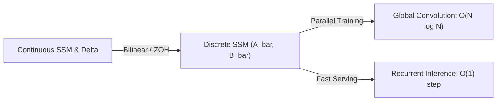

# The Structured Linear Time-Invariant Era (S4)

## Overview
The Structured State Space (S4) model introduced structured transition matrices (specifically using HiPPO matrix initialization) to successfully model long-range dependencies in deep learning, enabling parallelized training like CNNs and fast inference like RNNs.

## Architecture Diagram

## Technical Details
### HiPPO Matrix Initialization
The S4 model addresses the vanishing/exploding gradient problem by using the **High-order Polynomial Projection Operator (HiPPO)** framework. The transition matrix $A \in \mathbb{R}^{N \times N}$ is initialized to a structured matrix that projects the history of the input signal onto Legendre polynomials:
$$A_{nk} = -\begin{cases} (2n+1)^{1/2}(2k+1)^{1/2} & \text{if } n > k \\ n+1 & \text{if } n = k \\ 0 & \text{if } n < k \end{cases}$$
This allows the state $h(t)$ to mathematically memorize historical inputs over long horizons.

### Linear Time-Invariance (LTI)
Because the matrices $A$, $B$, and $C$ are independent of time $t$ and input $x(t)$, the recurrence relation can be unrolled globally as a single non-local convolution:
$$\bar{K} = (C\bar{B}, C\bar{A}\bar{B}, \dots, C\bar{A}^{L-1}\bar{B})$$
This allows the entire sequence to be computed in parallel during training using Fast Fourier Transforms (FFT).

## References
- Gu, A., Goel, K., & Ré, C. (2021). "Efficiently Modeling Long Sequences with Structured State Spaces." *arXiv preprint arXiv:2111.00396*.
- Gu, A., Dao, T., Ermon, S., Atzmon, Y., & Ré, C. (2020). "HiPPO: Recurrent Memory with Optimal Polynomial Projections." *NeurIPS*.

---
[← Back to README](../README.md)
