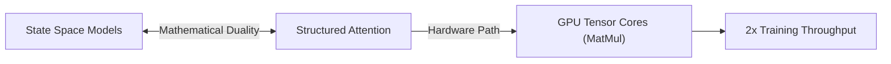

# Structured State Space Duals (SSD / Mamba-2)

## Overview
Structured State Space Duals (SSD) establishes a mathematical bridge between SSMs and structured attention mechanisms, enabling the use of Tensor Core matrix multiplication to double training speeds.

## Architecture Diagram

## Technical Details
### The Dual Representation
Mamba-2 proves that a class of selective SSMs can be represented as a form of attention with a structured mask. Specifically, the state update:
$$h_i = A_i h_{i-1} + B_i x_i$$
$$y_i = C_i h_i$$
can be written as a matrix multiplication:
$$Y = (C \cdot H) \cdot B^T \odot M$$
where $M$ is a structured mask matrix.

### Hardware Benefits
Standard GPU architectures are highly optimized for Matrix Multiplication (GEMM) via Tensor Cores. By formulating the state space scan as a structured matrix multiplication, Mamba-2 bypasses compiler memory-bound limitations, yielding over $2\times$ improvement in training throughput compared to Mamba-1.

## References
- Dao, T., & Gu, A. (2024). "Transformers are SSMs: Generalized Models and Efficient Algorithms Through Structured State Space Duals." *arXiv preprint arXiv:2405.21060*.

---
[← Back to README](../README.md)
