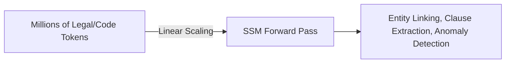

# Ultra-Long Context Document & Legal Auditing

## Overview
State Space Models scale context windows to millions of tokens, enabling the ingestion of entire legal databases and codebases for auditing without memory crashes.

## Architecture Diagram

## Technical Details
### Real-World Relevance
In fields such as legal auditing, compliance, and systems engineering, documents can span hundreds of thousands or millions of tokens.
- **Transformer Limitation:** Processing a 1,000,000 token document requires Terabytes of GPU memory just for the attention matrix.
- **SSM Capability:** SSMs scale linearly ($O(N)$) during training and maintain a constant memory profile during inference, permitting full-document processing on single, commodity GPU nodes.

### Applications
- **Legal Compliance:** Ingesting multiple regulatory acts to flag anomalies or contradictory clauses.
- **Codebase Auditing:** Evaluating complex software architectures for structural flaws or security holes in a single context window.

## References
- Gu, A., & Dao, T. (2023). "Mamba: Linear-Time Sequence Modeling with Selective State Spaces." *arXiv preprint arXiv:2312.00752*.

---
[← Back to README](../README.md)
